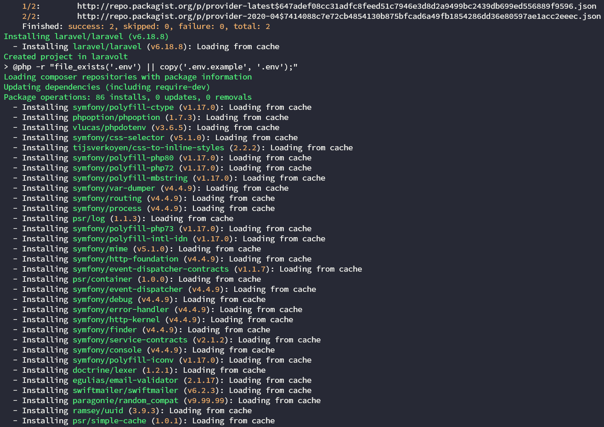

Halo semua, pada kesempatan kali ini saya akan memberi *tutorial* cara memasang *template* buatan sendiri atau beli dari *marketplace* untuk digunakan di *project* Laravel. Dengan bantuan *platform* **Laravolt**, sebuah teknologi apakah itu?

Jadi, singkatnya ***Laravolt*** adalah sebuah *platform* karya anak bangsa yang bisa digunakan untuk mempercepat pembuatan sebuah sistem informasi dalam 2 minggu. *Ga* percaya? Coba saja langsung sendiri dan rasakan *magic*-nya!

Sebelum lanjut, disini saya akan menggunakan Laravel *long term support* yang terakhir versi 6 dan sebuah *template* karya ***CSS Ninja*** bernama **Dashkit**.

> ***Disclaimer*** dulu ya, pada *tutorial* kali ini kita akan mengganti halaman authentication yang sebelumnya sudah disediakan oleh *platform* Laravolt.

## Install Laravel versi 6

Cara yang paling sederhana meng-install Laravel LTS versi 6 adalah dengan ***composer***, dengan *command*:

```bash
composer create-project --prefer-dist laravel/laravel [nama-project] "6.*"
```

