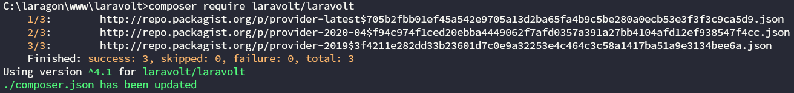
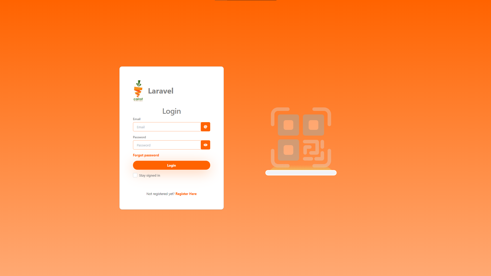
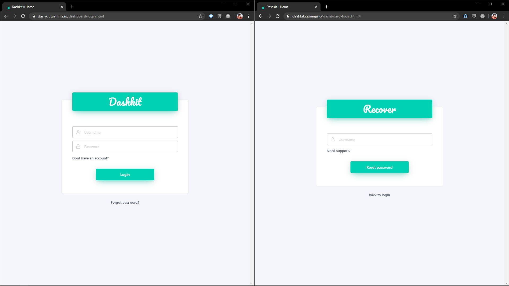
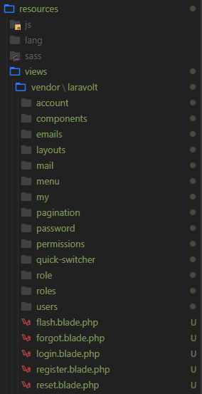

Halo semua, pada kesempatan kali ini saya akan memberi *tutorial* cara memasang *template* buatan sendiri atau beli dari *marketplace* untuk digunakan di *project* Laravel. Dengan bantuan *platform* **Laravolt**, sebuah teknologi apakah itu?

Jadi, singkatnya ***Laravolt*** adalah sebuah *platform* karya anak bangsa yang bisa digunakan untuk mempercepat pembuatan sebuah sistem informasi dalam 2 minggu. *Ga* percaya? Coba saja langsung sendiri dan rasakan *magic*-nya!

Sebelum lanjut, disini saya akan menggunakan Laravel *long term support* yang terakhir versi 6 dan sebuah *template* karya ***CSS Ninja*** bernama **Dashkit**.

> ***Disclaimer*** dulu ya, pada *tutorial* kali ini kita akan mengganti halaman authentication yang sebelumnya sudah disediakan oleh *platform* Laravolt.

## Install Laravel versi 6

Cara yang paling sederhana meng-install Laravel LTS versi 6 adalah dengan ***composer***, dengan *command*:

```bash
composer create-project --prefer-dist laravel/laravel [nama-project] "6.*"
```


Jangan lupa *setup file* ***.env*** di *project*, *lho*!

## Install Laravolt

Sebelum menambahkan Laravolt dengan *command line*, jangan lupa masuk ke *folder project*, ya! Setelah itu, *install* Laravolt sesuai dengan dokumentasi resminya di [https://laravolt.dev/docs/installation/](https://laravolt.dev/docs/installation/).





*Nah*, seperti yang telah saya jelaskan diatas. Untuk permulaan ini, mari kita fokuskan dulu untuk merubah halaman *authentication*, yakni halaman ***login, register*** dan ***forgot password***. Ekspektasi yang diharapkan adalah seperti gambar dibawah ini.



## Publish files

Kita akan meng-*override file* ***.blade.php*** yang digunakan oleh Laravolt di *folder vendor* ke *folder resources/views* dengan sebuah *command* yang sangat simpel:

```bash
php artisan vendor:publish --tag=laravolt-views
```



*Well*, sampai disini kita bisa meng-*customize* tampilan *platform* Laravolt sesuai dengan keinginan kita dengan cara meng-*edit files* di *folder views* yang barusan kita *publish*. Nantikan *tutorial part 2*-nya hanya di ***ID Laravel***, *cheers*! 🍻