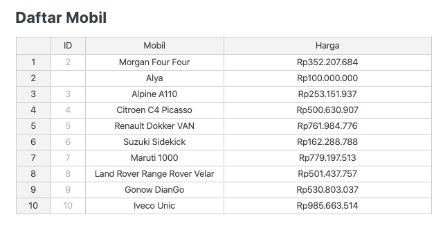
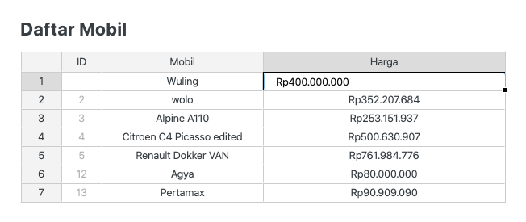
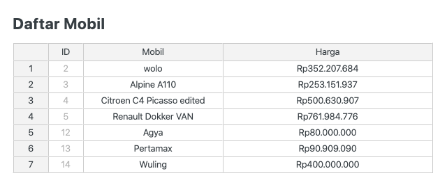

> Ini adalah tulisan kedua tentang CRUD di Laravel memakai jExcel. Jika Anda belum membaca [bagian pertama](/post/laravel-crud-memakai-jexcel), saya sarankan untuk membacanya terlebih dahulu.


## Pendahuluan

Sedikit review dari bagian pertama, kita sudah berhasil melakukan 3 dari 5 hal berikut:

1. Menampilkan data ✅
2. Input bulk data ✅
3. Validasi ✅
4. Edit data
5. Hapus data 

Untuk edit dan hapus data, kita akan mencoba melakukannya sebagaimana cara kerja excel atau spreadsheet lainnya: 

1. Apa yang ada di spreadsheet harus sama dengan apa yang disimpan di database.
2. Edit data dilakukan dengan langsung mengedit isi cell. 
3. Hapus data dilakukan dengan menghapus row.
4. Proses penyimpanan dilakukan dengan menekan sebuah tombol **"Simpan"**.

Pada umumnya, proses CRUD membutuhkan beberapa halaman: index, form create, form edit, dan halaman detil. Ketika memakai spreadsheet, maka sejatinya kita hanya memerlukan satu buah halaman saja karena semua proses dilakukan langsung melalui spreadsheet. Oleh sebab itu, kita akan melanjutkan halaman jExcel yang sudah kita buat untuk proses input data agar sekaligus bisa mendukung edit dan delete.

## Menampilkan Data Yang Sudah Diinput

Perubahan pertama yang perlu dilakukan adalah menampilkan data yang sudah diinput ke database. Sebelumnya kita sudah membuat halaman index, yang diperlukan hanya memindahkan beberapa *logic* untuk menampilkan data.

Pindahkan kode untuk query data:

```php
public function create()
{
  $items = Mobil::all(['nama', 'harga']);

  return view('mobil.create', compact('items'));
}

```

Modifikasi bagian view:

```javascript
$('#spreadsheet').jexcel({
  // jika old('data') kosong (berarti halaman baru dibuka), tampilkan data dari $items
  data: {!! old('data', json_encode($items)) !!},
  columns: [
    {type: 'text', title: 'Mobil', width: 200},
    {type: 'numeric', title: 'Harga', width: 300, mask: 'Rp#.##,00', decimal: ','},
  ]
});

// hanya munculkan dummy rows ketika old data dan data dari database kosong
@if(!old('data') && $items->isEmpty())
$('#spreadsheet').jexcel('insertRow', 10, 0);
@endif

```

Sampai disini kita berhasil menyimpan *state* dari spreadsheet ketika ada perubahan namun validasi gagal. Tapi ada beberapa masalah dengan implementasi kita sejauh ini.

### Masalah: Spreadsheet Tidak Bisa Disimpan

Mencoba menyimpan form selalu memunculkan pesan validasi gagal meskipun semua cell telah terisi data. Hal ini disebabkan karena perbedaan perlakuan dari jExcel untuk data hasil input manual (diketik sendiri) dengan data yang diset dari database. Ketika diketik manual, value yang disimpan langsung disesuaikan dengan format kolom (mask). Namun, ketika data diset dari database, value disimpan dengan tanpa format.


Pada gambar di atas, kita bisa melihat ketika harga pada row pertama diedit barulah representasi data diformat sesuai definisi kolom, sedangkan untuk data lain disimpan apa adanya **("523462368.00" vs "Rp523.462.368.00)**.

Hal ini berkaitan dengan proses validasi yang dilakukan di `prepareForValidation`:

```php
$formatter->parseCurrency('Rp100.000,00', $curr) // return 100000
$formatter->parseCurrency('100000', $curr) // return false
```

Berarti kita butuh fungsi untuk mengkonversi nominal rupiah yang lebih baik. Untuk kemudahan, kita akan melakukan beberapa penyederhanaan agar bisa lebih fokus ke jExcel dibanding hal teknis lainnya.

**Pertama**, harga mobil tidak perlu angka di belakang koma. Untuk itu, kita perlu memperbaiki beberapa hal:

1. Ubah format kolom menjadi `mask: 'Rp#.##'`
2. Ubah migration script untuk kolom harga menjadi `$table->decimal('harga', 12, 0)`

**Kedua**, kita perbaiki proses konversi harga dengan memanfaatkan fungsi `filter_var` bawaan PHP:

```php
public function prepareForValidation()
{
  $data = json_decode(request('data'));
  $formattedData = [];

  foreach ($data as $row) {
    $formattedData[] = [
      'nama' => $row[0],
      'harga' => filter_var($row[1], FILTER_SANITIZE_NUMBER_INT),
    ];
  }

  $this->merge(['data' => $formattedData]);
}

```

Sekarang format harga sudah berhasil disimpan dengan baik. Hanya saja setiap kali kita menyimpan form, data selalu bertambah (bukan update). Permasalah ini akan kita perbaiki di bab selanjutnya. Yuk, lanjut!

## Input, Edit, Dan Hapus Data

https://bossanova.uk/jexcel/v3/examples/column-types

Sesuai penjelasan sebelumnya, umumnya proses CRUD menggunakan spreadsheet dilakukan dalam satu halaman. Oleh sebab itu, kita akan mencoba handle ketiga proses tersebut sekaligus.

### Tambah Kolom ID Sebagai Identifier

Kita memerlukan sebuah identifier untuk membedakan mana kolom baru dan mana kolom lama. Untuk ini, kita bisa memakai *primary key* dari tabel mobil, yaitu kolom `id`.

Modifikasi method `MobilController@store`:

```php
$items = Mobil::all(['id', 'nama', 'harga']);
```

Lalu tampilkan kolom id tersebut di jExcel sebagai kolom pertama:

```javascript
columns: [
  {type: 'text', readOnly: true, title: 'ID'},
  {type: 'text', title: 'Mobil', width: 200},
  {type: 'numeric', title: 'Harga', width: 300, mask: 'Rp#.##', decimal: ','},
]
```

Terakhir, kita perlu sesuaikan juga fungsi `prepareForValidation` karena index dari jExcel berubah:

```php
foreach ($data as $row) {
  $formattedData[] = [
    'id' => $row[0],
    'nama' => $row[1],
    'harga' => filter_var($row[2], FILTER_SANITIZE_NUMBER_INT),
  ];
}
```


Anda bisa mencoba menambah row baru atau menghapus salah satu row. Sekarang kita bisa membedakan mana data lama dan mana data baru. Selanjutnya tinggal diproses di controller.



```php
array:10 [▼
  0 => array:3 [▼
    "id" => 2
    "nama" => "Morgan Four Four"
    "harga" => "352207684"
  ]
  1 => array:3 [▼
    "id" => ""
    "nama" => "Alya"
    "harga" => "100000000"
  ]
  2 => array:3 [▼
    "id" => 3
    "nama" => "Alpine A110"
    "harga" => "253151937"
  ]
  3 => array:3 [▼
    "id" => 4
    "nama" => "Citroen C4 Picasso"
    "harga" => "500630907"
  ]
  4 => array:3 [▼
    "id" => 5
    "nama" => "Renault Dokker VAN"
    "harga" => "761984776"
  ]
  5 => array:3 [▶]
  6 => array:3 [▼
    "id" => 7
    "nama" => "Maruti 1000"
    "harga" => "779197513"
  ]
  7 => array:3 [▶]
  8 => array:3 [▶]
  9 => array:3 [▶]
]
```

### Memproses Data

Berdasar data `id` di atas, kita bisa melakukan 3 hal sekaligus:

1. Hapus dari database semua row yang `id` nya tidak exists
2. Update semua record yang id tidak kosong
3. Simpan sebagai record baru untuk row yang `id` nya kosong

Tidak ada yang aneh seharusnya, sekedar *looping* biasa dengan sedikit *if else*:

###### app/Http/Controllers/MobilController.php

```php
use Illuminate\Support\Facades\DB;

...
  
public function store(Store $request)
{
  $data = $request->get('data');

  // Biasakan untuk selalu membungkus dengan transaction jika melakukan insert/update/delete beberapa query sekaligus
  DB::transaction(function () use ($data) {

    // hapus data
    $ids = collect($data)->pluck('id');
    if (!empty($ids)) {
      Mobil::whereNotIn('id', $ids)->delete();
    }

    foreach ($data as $row) {
      if ($row['id']) {
        // update existing data
        Mobil::whereId($row['id'])->update($row);
      } else {
        // insert data baru
        Mobil::create($row);
      }
    }
  });

  return redirect()->back()->withSuccess(sprintf("Berhasil menyimpan %d data mobil", count($data)));
}
```

### Masalah: Data Tidak Terurut

Kita sudah berhasil menampilkan, menambah, mengedit, dan menghapus data dalam satu tampilan layaknya *spreadsheet* pada umumnya. Yang menjadi masalah sekarang adalah, data yang kita tambahkan dengan insert row baru urutannya berubah setelah disimpan.

#### Sebelum Disimpan



#### Setelah Disimpan



#### Solusi

Jika memang urutan data ini penting, maka kita perlu menambahkan sebuah kolom baru untuk menyimpan urutan, misalnya `posisi`.

Tambahkan kolom `posisi` di migrasi:

```php
$table->unsignedInteger('posisi')->default(1);
```

Ubah query di controller agar terurut berdasar `posisi`:

```php
$items = Mobil::orderBy('posisi')->get(['id', 'nama', 'harga']);
```

**Perhatikan**: sekarang kita memanggil `get()`, bukan `all()` karena ada fungsi `orderBy()` yang dipanggil sebelumnya.

Perbaiki lagi fungsi `prepareForValidation` dengan menambahkan `posisi`:

```php
foreach ($data as $index => $row) {
  $formattedData[] = [
    'id' => $row[0],
    'nama' => $row[1],
    'harga' => filter_var($row[2], FILTER_SANITIZE_NUMBER_INT),
    'posisi' => $index + 1,
  ];
}

```

Sekarang bentuk data yang kita miliki sudah memiliki `posisi` yang terurut:

```php
array:11 [▼
  0 => array:4 [▼
    "id" => ""
    "nama" => "Agya"
    "harga" => "9898098"
    "posisi" => 1
  ]
  1 => array:4 [▼
    "id" => 1
    "nama" => "Asia Cosmos"
    "harga" => "288489456"
    "posisi" => 2
  ]
  2 => array:4 [▼
    "id" => 2
    "nama" => "Lamborghini Countach"
    "harga" => "608912716"
    "posisi" => 3
  ]
  3 => array:4 [▼
    "id" => 3
    "nama" => "Acura ZDX"
    "harga" => "615180054"
    "posisi" => 4
  ]
  4 => array:4 [▼
    "id" => 4
    "nama" => "Praga Baby Baby"
    "harga" => "667787660"
    "posisi" => 5
  ]
  5 => array:4 [▶]
  6 => array:4 [▶]
  7 => array:4 [▶]
  8 => array:4 [▶]
  9 => array:4 [▶]
  10 => array:4 [▶]
]
```

Langkah terakhir, kita tambahkan kolom `posisi` ke dalam `$fillable`:

```php
protected $fillable = ['nama', 'harga', 'posisi'];
```

Selesai. Kita tidak perlu mengubah apapun di controller karena kita menyimpan data dengan cara [*mass assignment*](https://laravel.com/docs/master/eloquent#mass-assignment). Data yang kita *passing* sebagai parameter, selama sudah kita definisikan di *$fillable*, otomatis akan tersimpan di database.

## Penutup

Selamat, kita sudah berhasil menyelesaikan 5 target awal untuk melakuan CRUD dengan jExcel dan Laravel:

1. Menampilkan data ✅
2. Input bulk data ✅
3. Validasi ✅
4. Edit data ✅
5. Hapus data ✅

Apa yang dibahas dalam 2 bagian tulisan ini masih sangat sederhana. Ada beberapa eksplorasi yang bisa dilakukan kedepannya, antara lain bagaimana menghilangkan tombol **"Simpan"** dan menggantinya dengan mekanisme *auto save* seperti pada Google Spreadsheet. Mungkin akan kita bahas pada bagian ketiga tulisan ini, semoga 😇.