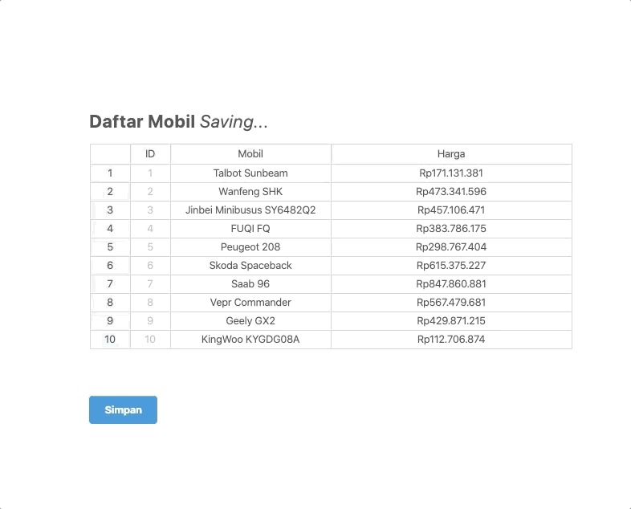

> Ini adalah tulisan ketiga tentang CRUD di Laravel memakai jExcel. Pastikan Anda sudah membaca dua tulisan sebelumnya:
>
> 1.  [Bagian 1: Menampilkan, input, dan validasi data](/post/laravel-crud-memakai-jexcel)
> 2.  [Bagian 2: Edit dan hapus data](/post/laravel-crud-memakai-jexcel-2)


## Pendahuluan

Di dua tulisan sebelumnya, kita sudah berhasil membuat fungsionalitas seperti layaknya spreadsheet:

1. Menampilkan data ✅
2. Input bulk data ✅
3. Validasi ✅
4. Edit data ✅
5. Hapus data ✅

Yang masih mengganjal adalah proses menyimpan data masih dilakukan secara manual, yaitu dengan menekan tombol **"Simpan"**. Hal ini sebenarnya wajar kita temui di *software spreadsheet* versi desktop seperti Microsoft Excel. Namun, untuk software yang berbasis online seperti Google Spreadsheet, proses simpan biasanya dilakukan secara otomatis ketika terjadi perubahan, atau biasa disebut dengan *auto save*.

## Analisa Auto Save Pada jExcel

Sebelum memulai koding, mari kita tuliskan dulu opsi-opsi yang mungkin dilakukan untuk menambahkan fungsi *auto save* ini. Ada dua faktor yang perlu dipertimbangkan:

1. Kapan auto save dilakukan?
2. Data yang mana yang dikirim ke server untuk disimpan?

### Kapan Auto Save Dilakukan?

#### Periodik Setiap Beberapa Detik

Proses simpan dilakukan secara periodik dengan teknologi AJAX, memanfaatkan fungsi `setInterval` dari Javascript.

##### Kelebihan

Simpel. Kita tidak perlu tahu event apa yang menyebabkan spreadsheet berubah. Pokoknya setiap sekian detik kita kirim semua data ke server.

##### Kekurangan

Kurang cocok jika pengguna sangat banyak karena bisa menghabiskan resource server. AJAX bisa diganti dengan *long pooling* atau koneksi menggunakan *socket* tapi tentu akan menambah kompleksitas cara ini.

#### Ketika Ada Perubahan Saja (On Demand)

Proses simpan dilakukan ketika terjadi penambahan row, perubahan data, dan penghapusan row. Cara ini bisa dilakukan dengan memanfaatkan *event* dari jExcel seperti `onchange`, `oninsertrow`, dan `onbeforedeleterow`. Daftar *event* yang dimiliki jExcel bisa dilihat di https://bossanova.uk/jexcel/v3/docs/events.

##### Kelebihan

Hemat sumber daya server karena hanya melakukan request ketika dibutuhkan.

##### Kekurangan

Sedikit komplek di bagian Javascript karena harus menangani semua *event* yang bisa menyebabkan perubahan *state* spreadsheet.

### Data Yang Dikirim

#### Keseluruhan Spreadsheet

Setiap kali proses simpan dilakukan, maka keseluruhan data spreadsheet dikirim ke server. Cara ini sudah kita lakukan [sebelumnya](/post/laravel-crud-memakai-jexcel-2).

##### Kelebihan

Simpel. Dan kita sudah pernah membuatnya.

##### Kekurangan

Tidak cocok untuk spreadsheet yang sangat besar, karena *query* ke database bisa menjadi lama. Ingat, di [tutorial sebelumnya](/post/laravel-crud-memakai-jexcel-2) kita melakukan looping data dan insert satu per satu. Cara tersebut bisa diubah menjadi ***delete+insert***. Setiap kali proses simpan dilakukan, hapus semua data lama dan simpan data baru secara *bulk insert*.

#### Hanya Data Yang Berubah

Dengan cara ini, maka hanya data yang berubah saja yang dikirim ke server. Misal pengguna mengubah cell A1, maka hanya value dari cell A1 dan koordinat cell yang dikirim ke server. Begitu juga jika menghapus row, hanya index (atau key) dari row tersebut yang kita kirim ke server untuk dihapus. Silakan lihat halaman  https://bossanova.uk/jexcel/v3/examples/events untuk lebih menjiwai bagaimana event di jExcel di-*trigger*.

##### Kelebihan

Cara ini paling ideal dan hemat resource.

##### Kekurangan

Kompleksitas di bagian Javascript karena harus menangani semua event yang menyebabkan perubahan data.

### Perbandingan

|                             | Auto Save Periodik                                           | Auto Save On Demand                                          |
| --------------------------- | ------------------------------------------------------------ | ------------------------------------------------------------ |
| **Kirim Semua Data**        | Implementasinya simpel.<br />Performa kurang baik untuk data besar atau  koneksi concurrent yang banyak | Kompleksitas di sisi Javascript untuk meng-handle setiap event yang menyebabkan perubahan data.<br /> |
| **Kirim Data Yang Berubah** | Tidak dianjurkan karena kompleksitas jadi berlipat. Pertama, kita harus handle setiap event di jExcel lalu menyimpan semua perubahan secara local di Javascript. Ketika auto save dilakukan, data local tersebut baru kita kirim ke server. Berarti dalam satu waktu kira harus mengirim tiga representasi data sekaligus: data baru, data yang diubah, dan data yang dihapus. | Paling ideal.<br />Implementasi cukup kompleks.              |

Melihat perbandingan di atas, kita akan mencoba cara yang paling simpel terlebih dahulu, yaitu **auto save periodik + kirim bulk data**.

## Implementasi Auto Save Pada jExcel

Sebelum mulai koding, mari kita definisikan dulu poin-poin yang harus terpenuhi:

1. Auto save dilakukan setiap setiap 10 detik sekali. Tombol **"Simpan"** yang sebelumnya sudah ada akan tetap kita pertahankan. Terkadang timbul perasaan "ada yang kurang" kalau pengguna tidak menekan sebuah tombol untuk melakukan penyimpanan data. Apalagi pengguna berusia lanjut 😌.
2. Ada pesan yang menandakan kalau proses *saving* sedang dilakukan.
3. Ada pesan yang menginformasikan apakah proses saving berhasil atau gagal.
4. Setelah proses *saving* berhasil, data yang ditampilkan di jExcel akan diupdate sesuai kondisi terakhir database. Hal ini untuk mengakomodir kalau ada pengguna lain yang juga melakukan perubahan data, sehingga data yang ditampilkan selalu data *fresh* dari database.

### Auto Save Secara Periodik Menggunakan AJAX dan jQuery

Pertama-tama kita persiapkan dulu kerangka AJAX-nya:

```javascript
// Jalankan fungsi sync() setiap 10 detik sekali
setInterval(sync, 10000);

function sync() {
  var data = $('#spreadsheet').jexcel('getData');
  $('#status').html('Saving...');

  // Kirim data jExcel via AJAX, jangan lupa sertakan CSRF Token standard Laravel
  $.post("{{ route('mobil.store') }}", {data: JSON.stringify(data), _token: "{{ csrf_token() }}"})
    .done(function (data) {
    $('#status').html('Saved');
  })
    .fail(function () {
    $('#status').html('Error');
  })
    .always(function () {
    setTimeout(function () {
      $('#status').html('');
    }, 3000)
  });
}

```

Jika Anda melihat `$('#status')` di atas, jangan khawatir, saat ini memang belum ada. Mari kita tambahkan. Jadi fungsi div #status tersebut hanya untuk menampilkan pesan loading, sukses, dan gagal. Pada kondisi nyata, Anda bisa menggantinya dengan library notifikasi seperti sweetAlert atau Notify.js.

```html
<h2 class="ui header">Daftar Mobil <span style="font-weight: normal; font-style: italic" id="status"></span></h2>
```


Lalu siapkan controller untuk menangani request JSON tersebut. Tambahkan potongan kode berikut tepat sebelum blok kode `return` di `MobilController@store`:

###### app\Http\Controllers\MobilController.php

```php
if ($request->expectsJson()) {

  // pura-pura ada proses lama, agar terlihat status loading-nya
  sleep(1);

  return response()->json([]]);
}

```

Hasilnya bisa dilihat seperti di bawah ini:



Anda bisa mencoba mengosongkan salah satu cell, dan status akan berubah menjadi **"Error"**. Meskipun belum berfungsi, namun minimal kita sudah bisa membuat simulasi flow yang akan dijalankan. Langkah selanjutnya tinggal mengimplementasi *logic* untuk menyimpan ketika ada request AJAX.

### Menyimpan dan Mengembalikan Data JSON

Kerangka yang kita buat di atas sudah cukup menggambarkan flow aplikasi. Yang perlu dilakukan hanyalah mengubah controller `MobilController@store` agar bisa mengembalikan data JSON yang tepat.

```php
if ($request->expectsJson()) {
 
  // pura-pura ada proses lama, agar terlihat status loading-nya
  sleep(1);
 
  // Query ke database dan menyesuaikan format agar sesuai dengan jExcel
  $items = Mobil::orderBy('posisi')
    ->get(['id', 'nama', 'harga'])
    ->transform(function ($item) {
      return array_values($item->toArray());
    });

  return response()->json($items);
}
```

Disini ada sedikit perbedaan format JSON dengan potongan kode dari fungsi `MobilController@index`:

```php
$items = Mobil::orderBy('posisi')->get(['id', 'nama', 'harga']);
```

Perbedaan antara kedua potongan kode di atas adalah JSON yang dihasilkan:

```javascript
// hasil dari fungsi index() berupa JSON object
[{"id":1,"nama":"Talbot Sunbeam","harga":"171131381"},{"id":2,"nama":"Wanfeng SHK","harga":"473341596"}]

// hasil dari fungsi store() berupa JSON array
[[1,"Talbot Sunbeam","171131381"],[2,"Wanfeng SHK","473341596"]]

```

Hal ini memang *behaviour* dari jExcel dimana terdapat perbedaan format data antara inisiasi awal dibanding dengan memanggil fungsi `setData`. Isu terkait bisa [dibaca disini](https://github.com/paulhodel/jexcel/issues/177).

## Penutup

Sejauh ini fungsionalitas normal *auto save* sudah berhasil kita implementasikan. Namun, masih ada beberapa perbaikan yang bisa ditambahkan:

1. Ketika sedang mengedit salah satu cell lalu terjadi *auto save*, maka apa yang diketik akan hilang (tertimpa data dari server) karena belum sempat di-*enter*. Seharusnya bisa memanfaatkan fungsi `onselection` dan `onblur` untuk menentukan apakah *auto save* perlu dijalankan atau tidak.
2. Pesan error yang ditampilkan belum *user friendly*.

Silakan dicoba sendiri untuk melatih problem solving dan menambah pemahaman terhadap jExcel 😎.

> Repository untuk seri tulisan jExcel ini bisa diakses di https://github.com/berbageek/jexcel-crud.