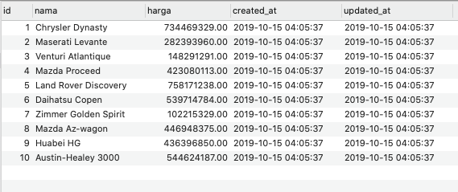

## Apa Itu jExcel?

jExcel adalah sebuah library Javascript untuk menampilkan data menyerupai *spreadsheet* atau *excel*. Ada kalanya mekanisme CRUD seperti di excel, dimana pengguna bisa langsung melakukan *editing* dan penambahan *row* dengan cepat, lebih disukai karena tidak ribet ketika melakukan banyak perubahan.

Tutorial kali ini akan membahas cara melakukan CRUD secara sederhana menggunakan jExcel, yang meliputi:

1. Input bulk data 
2. Validasi data
3. Edit data
4. Hapus data

Semua contoh kode akan menggunakan jExcel v3 dan jQuery.

## Persiapan

Kita akan membuat sebuah CRUD sederhana untuk melakukan input data mobil dengan atribut merk dan harga. Isi tabel mobil bisa dilihat di bawah ini:



Silakan buat migration dan seeder sendiri atau bisa mencoba hasil akhirnya di https://github.com/berbageek/jexcel-crud.

## Menampilkan Data

[jExcel](https://bossanova.uk/jexcel/v3/) adalah *library frontend*, jadi untuk mencobanya kita harus menyiapkan sebuah halaman index terlebih dahulu.

### Tambah Route

Buat sebuah route baru untuk menampilkan data:

```php
Route::get('mobil', 'MobilController@index')->name('mobil.index');
```

### Buat Controller

Buat Controller baru dengan perintah `php artisan make:controller MobilController`:

```php
<?php

namespace App\Http\Controllers;

use App\Mobil;

class MobilController extends Controller
{
    public function index()
    {
        // mempersiapkan data untuk jexcel
        $items = Mobil::all(['nama', 'harga']);

        return view('mobil.index', compact('items'));
    }
}
```

Yang patut diperhatikan adalah pemanggilan `Mobil::all(['nama', 'harga'])` dimana kita menyebutkan secara spesifik kolom yang diminta, sesuai apa yang akan ditampilkan di jExcel.

### View

Menampilkan jExcel di view cukup dilakukan dalam 4 langkah mudah:

1. Siapkan div kosong sebagai placeholder
2. Tambahkan aset-aset jExcel
3. Persiapkan data JSON
4. Definisikan kolom

```html
@extends('ui::layouts.centered')
@section('content')

    <h2 class="ui header">Daftar Mobil</h2>

    <!-- step 1: placeholder -->
    <div id="spreadsheet"></div>

@endsection

@push('script')

    // step 2: include aset-aset jExcel
    <script src="https://bossanova.uk/jexcel/v3/jexcel.js"></script>
    <link rel="stylesheet" href="https://bossanova.uk/jexcel/v3/jexcel.css" type="text/css"/>
    <script src="https://bossanova.uk/jsuites/v2/jsuites.js"></script>
    <link rel="stylesheet" href="https://bossanova.uk/jsuites/v2/jsuites.css" type="text/css"/>

    <script>


      // step 3: ubah data dari Controller menjadi JSON
      var data = @json($items);

      // step 4: instansiasi jExcel dan definisikan kolom      
      $('#spreadsheet').jexcel({
        data: data,
        columns: [
          {type: 'text', title: 'Mobil', width: 200},
          {type: 'numeric', title: 'Harga', width: 300, mask: 'Rp#.##,00', decimal: ','},
        ]
      });
    </script>
@endpush
```

View di atas menggunakan template dari [laravolt/ui](https://github.com/laravolt/ui).

Sampai disini, kita berhasil menampilkan data dalam bentuk spreadsheet menggunakan jExcel. Bukan hanya menampilkan, jExcel juga sudah menyediakan fungsi-fungsi layaknya excel seperti menambah/menghapus kolom dan row, mengedit data secara inline, hingga menyimpan data dalam format CSV. Semuanya tersedia tanpa perlu banyak koding. Maknyuss.


## Input Bulk Data

## Validasi Data

## Edit Data

## Hapus Data