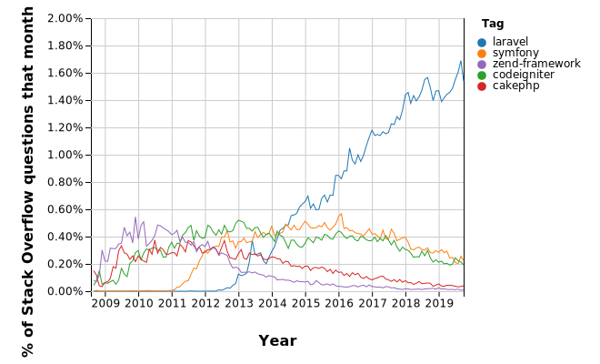

## Introduksi

Saat ini Laravel merupakan _framework_ PHP yang paling populer. Hal tersebut berdasarkan data dari jumlah pencarian Google dan StackOverflow, serta jumlah _stars_ pada GitHub. Tidak mengherankan.

_Framework_ PHP yang dibandingkan adalah Laravel, Symfony, CodeIgniter, CakePHP, dan Zend Framework. 

Berikut ini adalah data pencarian Google sejak tahun 2009 

   
  

Selanjutnya adalah data pencarian StackOverflow berdasarkan _tag_

Terakhir adalah jumlah _stars_ pada GitHub sampai saat artikel ini dibuat

- [Laravel](https://github.com/laravel/laravel): __56.2k__
- [Symfony](https://github.com/symfony/symfony): __22.1k__
- [CodeIgniter](https://github.com/bcit-ci/CodeIgniter): __17.7k__
- [CakePHP](https://github.com/cakephp/cakephp): __8k__
- [Zend Framework](https://github.com/zendframework/zendframework): __5.7k__

Dari sekian banyak kelebihan Laravel secara teknis, secara singkat dapat diuraikan sebagai berikut:

1. Mudah untuk pemula
2. Efisien untuk ahli
3. Memiliki dokumentasi yang lengkap dan jelas
4. Terdapat banyak _magic_ atau _helper_ 
5. Bisa digunakan untuk aplikasi kecil ataupun besar

Masih banyak sekali alasan kenapa Laravel sangat populer di kalangan pemula sampai ahli. 

Selamat datang di seri __"Laravel 6 Dasar"__!

## Tujuan
Lalu, untuk apa kami membuat seri ini ketika dokumentasi Laravel sangat apik dan mudah dipelajari serta tutorial berkualitas tinggi banyak tersedia?

Sama seperti alasan kenapa banyak sekali bahasa pemrograman yang dibuat, begitu juga dengan banyaknya _Framework_ PHP  yang bermunculan. Ada _value_ yang ingin disampaikan pada dunia, ada usaha untuk mencari solusi dari permasalahan sehari-hari. Tidak kurang dan tidak lebih. Kami berusaha membagikan pengetahuan kami dengan membuat seri yang berkualitas tinggi untuk membuat programer Laravel Indonesia yang masih pemula menjadi lebih baik. 

Lisensi Laravel disebut [lisensi MIT](https://opensource.org/licenses/MIT) yang artinya kita bisa mengopi, memodifikasi, dan membuat aplikasi secara cuma-cuma dengan tanggung jawab sepenuhnya ada pada kita.
Sehingga pada dasarnya kita bebas untuk membuat aplikasi berbasis Laravel dengan cara apapun selama hasilnya sesuai dengan kebutuhan kita atau klien. Namun ternyata hal tersebut berpotensi menjadi malapetaka ketika kita menggunakan Laravel dengan cara yang kurang tepat. Aplikasi yang dibuat menjadi lambat, tidak _secure_, bahkan terdapat banyak _bug_. Bukan salah Laravel tentunya. Hal tersebut dapat terjadi dikarenakan minimnya pengetahuan programer akan Laravel, MVC atau bahkan PHP itu sendiri tidak dikuasai dengan benar.

Kami mencoba untuk membagikan pengetahuan dari pengalaman membuat berbagai aplikasi menjadi materi-materi rutin yang terstruktur dan (diharapkan) mudah dimengerti.

## Alur dan Konten

Alur dari seri ini dirancang dengan tujuan membuat proyek sederhana yang komponen-komponen pengetahuannya dikenalkan terlebih dahulu secara terpisah.
Gambaran konten dari seri ini yaitu:

1. Persiapan _Development Environment_ & Hello Laravel
2. _Views_, _Controllers_, _Routing_
3. _Database_
4. Proyek 1
5. _Events_, _Queues_, _Email_
6. _Protection_ & _Security_
7. Proyek 2
8. _Deployment_

Setiap konten akan disajikan secara bertahap dalam beberapa post, sehingga seri ini akan sedikit lambat namun pasti. Jeda antara post diharapkan bisa dimanfaatkan untuk diskusi dan tanya jawab pada post-post sebelumnya.

## Target Audiens

Seri ini kami harapkan bisa membantu pemula yang akan menyelami dunia _web development_ dengan Laravel sebagai _framework_ pertamanya. Adapun bagi programer PHP yang sudah tidak asing dengan _framework_, seri ini bisa menjadi referensi sederhana untuk mempelajari Laravel dengan praktek langsung membuat proyek.
