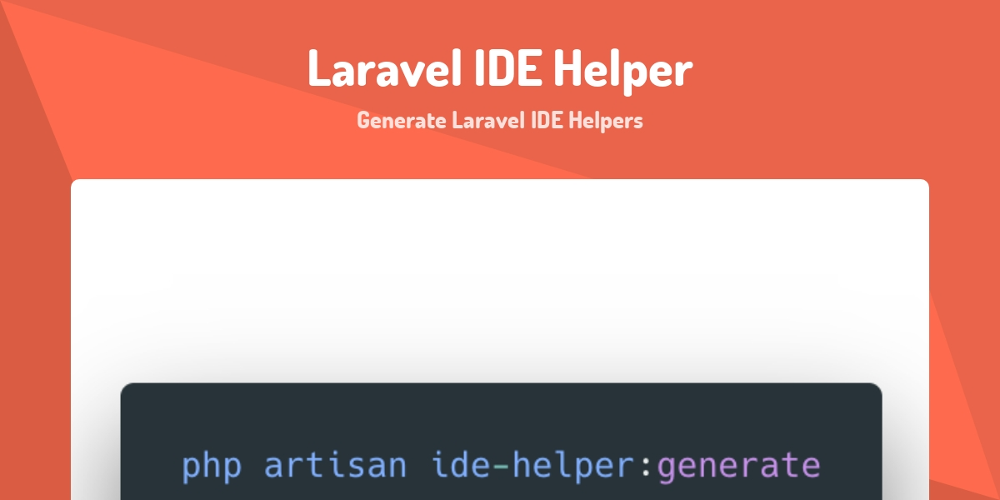

Fitur autocomplete merupakan fitur yang tidak bisa dipisahkan dari programmer untuk saat ini. Dengan fitur ini memungkinkan proses membuat aplikasi atau program yang kita buat menjadi lebih cepat dan efisien. Hal ini karena kita tidak perlu menulis secara manual kode yang akan kita buat, melainkan kode tersebut akan dilakukan secara otomatis oleh fitur autocomplete ini. Selain membuat proses membuat aplikasi menjadi lebih cepat, autocomplete juga dapat meminimalkan kesalahan ketik ketika kita sedang *ngoding*.



Untuk menggunakan fitur autocomplete ini, programmer harus menggunakan code editor atau IDE yang mendukung hal tersebut. Namun jangan khawatir, di era saat ini sudah banyak code editor atau IDE yang mempunyai fitur autocomplete baik yang berbayar maupun yang gratis, contohnya adalah Visual Studio Code, Sublime dan keluarga Jetbrains.

Fitur autocomplete di IDE keluarga Jetbrains bisa dikatakan sangat powerful dibandingkan dengan code editor yang lain. Ketika pertama kali membuka IDE Jetbrains, dia akan melakukan indexing terhadap semua kodingan kita sehingga semua kelas maupun method dapat langsung terindeks sehingga membuat fitur autocomplete ini dapat bekerja dengan sempurna.

Akan tetapi tidak ada kesempurnaan di dunia ini, termasuk dunia IDE. Autocomplete di Jetbrains ataupun di code editor lain tidak bisa melakukan fitur autocomplete pada kode yang bersifat *magic*. Salah satu framework populer di PHP sekarang yang bisa dikatakan banyak terdiri dari *magic* adalah Laravel. Akan tetapi, ada salah satu package di Laravel yang berguna untuk mengatasi kekurangan tersebut, yaitu package Laravel IDE Helper.


## Cara Instalasi

Langsung saja mari kita praktikan cara instalasi Laravel IDE Helper di Laravel bersama-sama.

1. Instalasi Laravel IDE Helper menggunakan Composer

   ```
   composer require --dev barryvdh/laravel-ide-helper
   ```

   Kenapa kita menggunakan opsi `--dev` disini ? Ini karena Laravel Ide Helper ini cuman berguna ketika kita mendevelop aplikasi saja dan tidak berguna ketika aplikasi kita ada di mode *production* ataupun *staging*.

2. Load package secara manual pada mode selain *production* dengan cara mendaftarkannya pada file `AppServiceProvider` di method `register()`

   ```php
   public function register()
   {
       if ($this->app->environment() !== 'production') {
           $this->app->register(\Barryvdh\LaravelIdeHelper\IdeHelperServiceProvider::class);
       }
       // ...
   }
   ```

3. Instalasi sudah selesai.

   

## Penggunaan

Setelah proses instalasi Laravel IDE Helper di atas selesai, maka untuk cara menggunakannya cukup mudah. Package ini mempunyai 3 fitur berbeda yang mempunyai kegunaan masing-masing, namun intinya ketiga fitur tersebut berguna untuk memaksimalkan fitur auto complete dari code editor / IDE yang kita gunakan. Berikut ketiga fitur tersebut :

- `php artisan ide-helper:generate`

  Berguna untuk fitur autocomplete pada facades

  Fitur :

  - Autocomplete semua facades
  - Autocomplete untuk Fluent method, contoh di migration : `$table->string("somestring")->nullable()->index();`

- `php artisan ide-helper:models`

  Berguna untuk fitur autocomplete pada Model. Command ini juga dapat membuat autocomplete pada setiap kolom pada tabel yang sudah dibuat, sehingga pastikan sudah terknoneksi dengan database ketika menggunakan fitur ini.

  Opsi :

  - `--write (-W)` : untuk menuliskan phpdocs pada model
  - `--nowrite (-N)` : untuk menuliskan phpdocs pada file `_ide_helper_models.php`

  Fitur :

  - magic `where*` : akan tersedia autocomplete untuk whereNamaKolom, contoh `User::whereName(...)`
  - magic `*_count` : akan tersedia autocomple untuk `*_count` ketika menggunakan fitur Eloquent [`::withCount`](https://laravel.com/docs/master/eloquent-relationships#counting-related-models).

  

- `php artisan ide-helper:meta`

  Berguna untuk fitur autocomplate dari IoC Contrainer, contohnya ketika pemanggilan `app('events')` akan mereturn object `Illuminate\Events\Dispatcher`.

  

## Bonus Tips

Supaya lebih ringkas ketika kita ingin menjalankan ketiga perintah di atas sekaligus, kita dapat mengumpulkan ketiga command di atas dalam satu command pada composer.

```
"scripts": {
	...
	"ide-helper": [
		"@php artisan ide-helper:generate",
        "@php artisan ide-helper:meta",
        "@php artisan ide-helper:models -N"
    ]
}
```

​	Setelah itu, kita dapat menjalankan `composer ide-helper`

## Faq

### Apakah hasil generate file dari package Laravel IDE Helper ini harus dimasukkan ke `.gitignore` atau tidak ?

Menurut saya harus dimasukkan ke `.gitignore` karena tidak semua programmer dalam tim kita membutuhkan fitur autocomplete dari Laravel IDE Helper ini atau bisa juga mereka juga sudah punya plugin di code editor mereka sendiri, sehingga akan redudansi jika ditambahkan package ini.

## Link Terkait

-    Github Laravel Ide Helper : https://github.com/barryvdh/laravel-ide-helper

-    https://madewithlaravel.com/laravel-ide-helper

     

Oke, begitulah cara instalasi dan penggunaan dari package Laravel IDE Helper. Semoga dengan adanya tutorial ini dapat meningkatkan kecepatan *ngoding*  kita sekaligus mengurangi kesalah ketik kita ketika mendevelop suatu aplikasi.