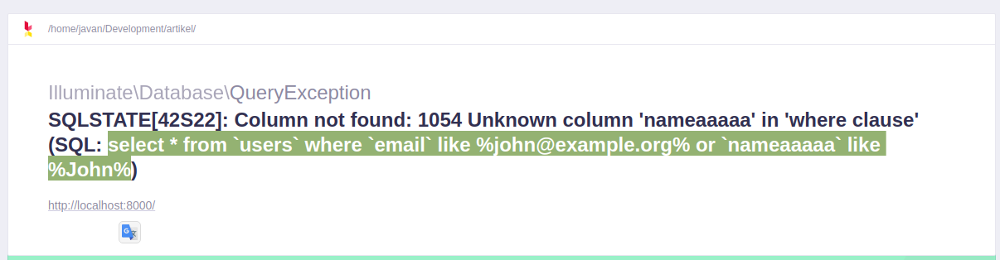
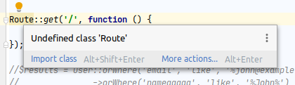
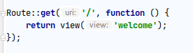

Laravel merupakan framework yang saat ini semakin digandrungi oleh programmer dimanapun berada, termasuk di Indonesia. Framework ini dapat menjawab kebutuhan bisnis yang sangat menekankan pada kualitas kode maupun ketahanan kode dalam menghadapi perubahan. Dengan menggunakan tools ini diharapkan pemrogram dapat lebih cepat dalam membangun aplikasi maupun melakukan perawatan pada aplikasi yang sudah jadi.
	
Framework ini mempunyai dokumentasi yang cukup jelas, lengkap dan terstruktur baik dokumentasi dalam websitenya ataupun dokumentasi di setiap kodenya. Komunitas yang besar juga dapat membuat dokumentasi yang sudah ada menjadi lebih jelas lagi. Akan tetapi dari sekian banyak dokumentasi tersebut ada semacam trik tersembunyi yang mungkin tidak dituliskan maupun sudah dituliskan tetapi mungkin terlalu sedikit sehingga terlewat oleh programmer.
	
Berikut ini merupakan beberapa trik tersembunyi yang berhasil kami rangkum berdasarkan pengalaman kami selama menggunakan framework ini :

### 1. Print sql dengan membuat error pada query
Dokumentasi di laravel menuliskan untuk melihat query sql yang sudah kita buat menggunakan eloquent maupun query builder dengan menggunakan ‘->toSql()’ dengan hasil sebagai berikut :

    $results = User::orWhere('email', 'like', '%john@example.org%')
			->orWhere('name', 'like', '%John%')
			->toSql();
    dd($results)

Hasil kode di atas akan menghasilkan seperti ini :

    select * from `users` where `email` like ? or `name` like ?

Dengan metode ‘->toSql()’ di atas masih mempunyai kekurangan, yaitu kita harus mengisi tanda ‘?’ di atas menggunakan nilai yang ingin kita masukkan.

<b>Cara tersembunyi : </b>

Dengan membuat error pada query tersebut, memungkinkan kita untuk melihat query tersebut beserta nilai yang kita masukkan pada where nya.

Contoh kita melakukan error pada query : 

    $results = User::orWhere('email', 'like', '%john@example.org%')
		->orWhere('nameaaaaa’, 'like', '%John%')
		->get();

Kemudian akan muncul halaman error seperti ini :

Nah kita tinggal ambil query yang kita blok di atas dan memperbaiki error query yang sudah kita buat sendiri kemudian kita jalankan di aplikasi SQL Client.

### 2. Auto complete dengan Laravel ide helper
Fitur code autocomplete merupakan fitur yang cukup penting ada di Code Editor ataupun Aplikasi IDE kita. Dengan menggunakan fitur tersebut membantu developer untuk mempercepat proses development karena kita tidak harus mengetik secara manual.

Namun, secanggih-canggihnya aplikasi Code Editor kita, tetap saja tidak bisa mengalahkan magic-magic yang ada di Laravel itu sendiri, contohnya :

Route di atas tidak bisa dijangkau oleh PhpStorm karena Laravel menggunakan Facade, sehingga menimbulkan warning. Bagi sebagian programmer yang mempunyai penyakit OCD, hal itu mungkin sangat mengganggu sehingga dapat mempengaruhi proses development programmer tersebut. Sehingga dibuatlah plugin Ide Helper ini.

Kode di atas tidak terdapat warning dan terlihat sangat sempurna  di mata seorang pengidap OCD.

### 3. Menggunakan where dengan whereNamaKolom
Biasanya kita menulis seperti ini

    ->where("namaKolom", "nilai")

Tapi sebenarnya kita juga bisa menuliskan seperti ini 
    
    ->whereNamaKolom("nilai")

### 4. View Composers 
Terkadang kita memerlukan variabel yang harus digunakan dibanyak view, daripada membuat satu persatu di setiap controller, kita bisa menggunakan salah satu fitur di Laravel yang mungkin sangat berguna. Nama fitur tersebut adalah View Composers.

    View::composer('sidebar', function($view) {
        $view->with('photo-profile', ‘images/default.jpg’);
    });

Dengan kode ini, setiap halaman sidebar dimuat, variabel ‘photo-profile’ akan dapat selalu dipakai.

### 5. Blade Loops
Biasanya ketika kita menggunakan foreach di Blade dan ingin menampilkan nomor perulangannya kita akan menuliskannya seperti ini :

    <?php $no = 1 ?>
    @foreach ($users as $key => $user)
        
Nomor {{ $no + $key }}

    @endforeach

Tetapi dengan fitur Loops di Blade, kita dapat menuliskannya menjadi seperti ini :

    @foreach ($users as $key => $user)
        
Nomor {{ $loop->iteration }}

    @endforeach

Tentunya kode kita dapat terlihat lebih bersih dan lebih efektif sehingga proses development pun menjadi lebih cepat. Sebenarnya banyak sekali fitur-fitur dari Blade Loops yang lain, kamu bisa melihat dokumentasinya di sini => https://laravel.com/docs/5.3/blade#the-loop-variable

Mungkin cukup itu saja tips trik tersembunyi di Laravel yang mungkin belum ketahui, semoga dengan hal ini bisa mempercepat proses development yang kamu lakukan.
